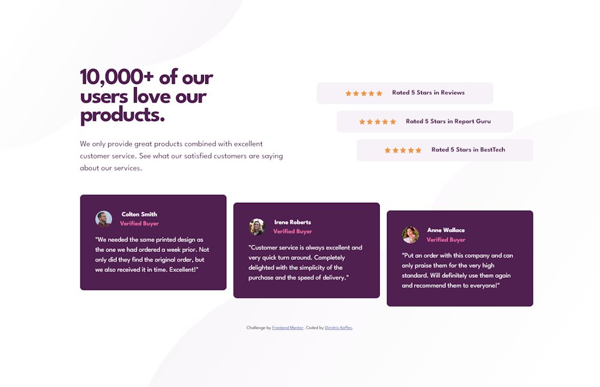

# Frontend Mentor - Social proof section solution

This is a solution from Dimitris Kaffes to the [Social proof section challenge on Frontend Mentor](https://www.frontendmentor.io/challenges/social-proof-section-6e0qTv_bA).

## Table of contents

- [Overview](#overview)
  - [The challenge](#the-challenge)
  - [Screenshot](#screenshot)
  - [Links](#links)
- [My process](#my-process)
  - [Built with](#built-with)
  - [What I learned](#what-i-learned)
  - [Continued development](#continued-development)
  - [Useful resources](#useful-resources)
- [Author](#author)

## Overview

Mobile first design approach was implemented for this challenge.

A modern CSS reset (by Andy Bell) was implemented.

Extensive use of Grid takes place for the overall layout as well as for the ratings and cards containers layout.

Flexbox is used for small groups of elements.

### The challenge

Users should be able to:

- View the optimal layout for the section depending on their device's screen size

### Screenshot

### Links

- Solution URL: [social-proof-section solution on Github](https://github.com/dkaffes/social-proof-section)
- Live Site URL: [social-proof-section live site](https://dkaffes.github.io/social-proof-section/)

## My process

The HTML structure was built with semantic elements.

The HTML design took into account how the layout should look like in both mobile and desktop versions so as to have the smallest adjustments in the media query.

Custom properties were used for the colors and font-weights.

Grid layout was used for the whole `.section` as well as for the `.ratings-container` and `.cards-container`.

Flexbox was used for small group of elements such as the `.rating--box` and the `.card--buyer-box`.

### Built with

- Semantic HTML5 markup
- CSS custom properties
- Flexbox
- CSS Grid
- Mobile-first workflow

### What I learned

A pretty good practice on a complex Grid and Flexbox combination layout.

Learned how to combine 2 background images with their appropriate `background-repeat` and `background-position` properties.

### Continued development

Futrher improve the design decisions and especially when it has to do with the choice between Grid and Flexbox.

### Useful resources

- [MDN background-image](https://developer.mozilla.org/en-US/docs/Web/CSS/background-image) - This helped me implement the combination of background images given in the design.

## Author

- Frontend Mentor - [@dkaffes](https://www.frontendmentor.io/profile/dkaffes)
